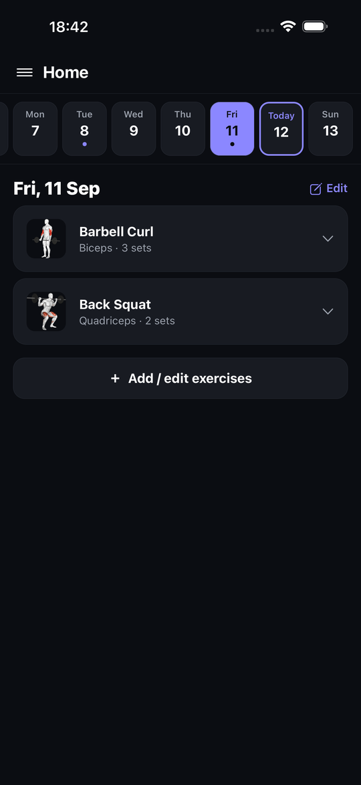
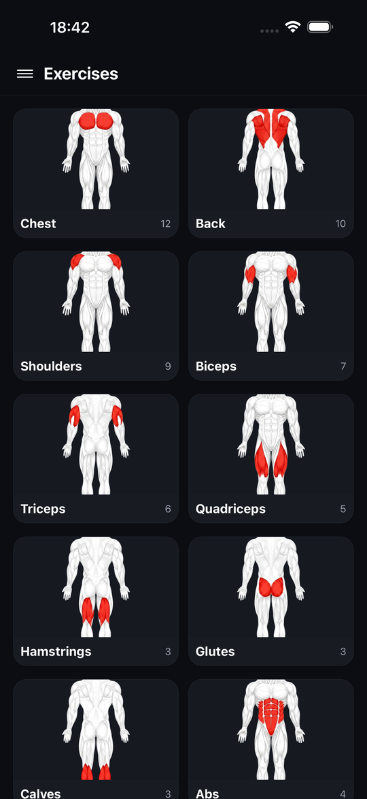
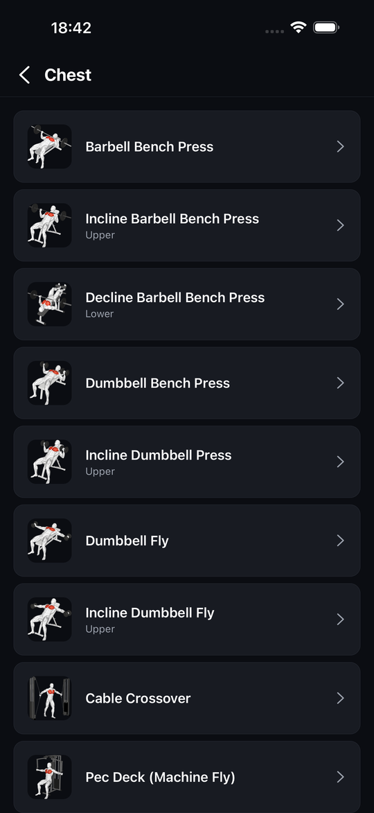
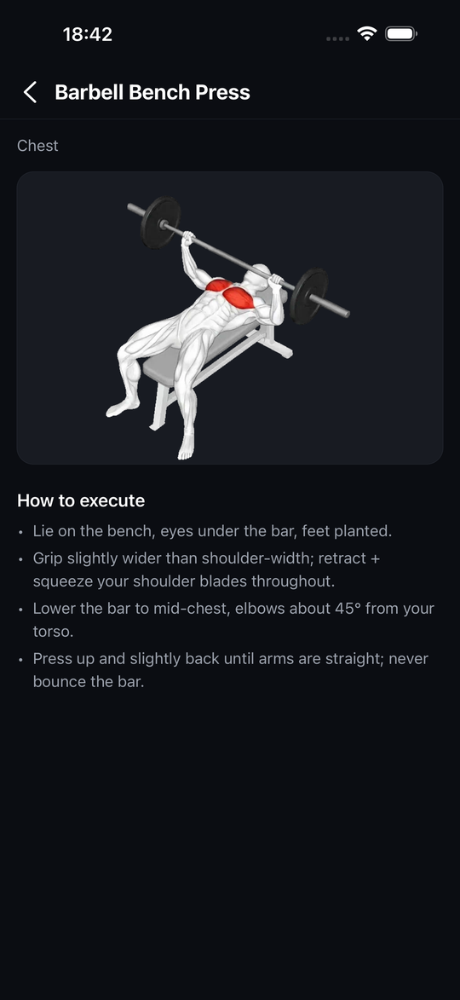
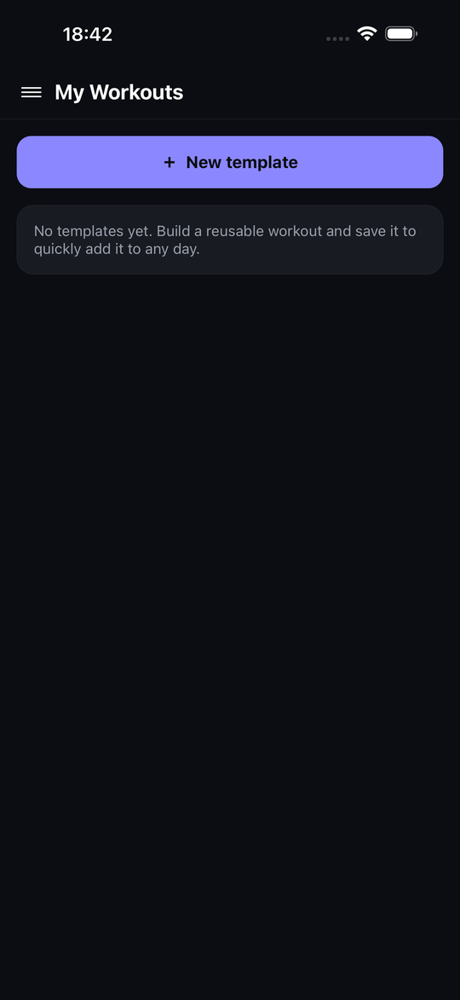
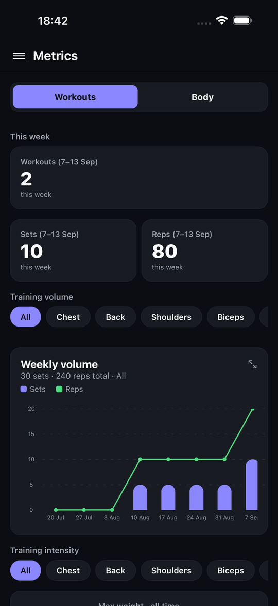
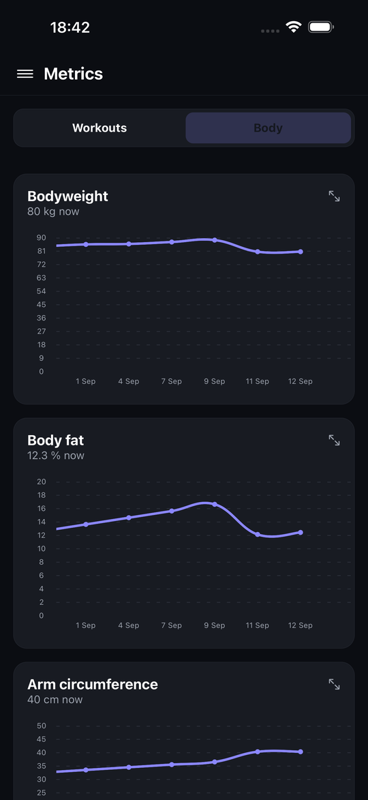
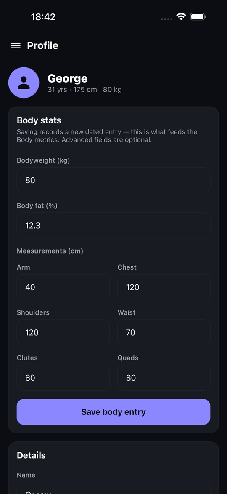

# B-Fit

A personal, **local-only** gym logging app for iPhone. No account, no server,
no analytics: everything lives in a SQLite database on the phone. Built with
Expo / React Native and TypeScript, dark theme only, weights in kg.

<p align="center">
  
  
  
  
  
</p>
<p align="center">
  
  
  
</p>

## What it does

- **Log workouts per day** — a week bar at the top, today highlighted; pick any
  day, add exercises with sets × reps × kg, expand a workout to see what was done.
- **Workout templates** — build a routine once from the exercise catalog, save
  it, and drop it onto any day in one tap. Templates can be edited and deleted.
- **Exercise catalog** — 78 exercises across 11 muscle groups (chest, back,
  shoulders, biceps, triceps, quadriceps, hamstrings, glutes, calves, abs,
  forearms). Every exercise has a start-pose thumbnail and most have a looping
  animation of the movement, drawn as an anatomy mannequin with the target
  muscle in red.
- **Body tracking** — bodyweight plus optional body fat % and circumferences
  (arm, chest, shoulders, waist, glutes, quads). One entry per day; logging the
  same day again replaces it.
- **Metrics dashboards** — Grafana-style dark panels:
  - *Workouts*: workouts / sets / reps this week, weekly volume (sets + reps)
    and training intensity (daily max weight), each filterable per muscle group.
  - *Body*: one panel per measurement with its history.
  - Tap a bar or a point for its value; every chart opens fullscreen.
- **Profile** — name, sex, height, date of birth; this is also where body
  entries are logged.

## Flows

**First launch** → onboarding asks for name, sex, height, weight and date of
birth (advanced body stats are optional) and lands on Home.

**Home** → week bar (Mon-start weeks, scrolls back 11 weeks) + the selected
day. A day with no workout shows an *Add workout* button; a day with one lists
its exercises, each expandable to sets/reps/kg, with an *Edit* action.

**Add workout** → either *from a saved template* or *build on the fly*:
choose a muscle group → choose an exercise → set sets / reps / kg → repeat →
save to the day.

**Left drawer** (swipe from the left or tap ☰) → Home, My Workouts
(templates), Exercises (browse by muscle group; tapping an exercise plays its
animation), Metrics, Profile.

## Architecture

```
mobile/
├── app.json                 Expo config (bundle id com.georgeblajan.bfit, scheme bfit://)
├── src/
│   ├── app/                 Expo Router screens (file-based routes)
│   │   ├── _layout.tsx      root Stack, dark nav theme, drawer mount
│   │   ├── index.tsx        first-launch gate → onboarding or home
│   │   ├── home.tsx         week bar + the selected day's workout
│   │   ├── add-workout.tsx  template vs. build-on-the-fly
│   │   ├── build-workout.tsx / configure-exercise.tsx / pick-group.tsx / pick-exercise.tsx
│   │   ├── exercises.tsx / exercise-detail.tsx
│   │   ├── workouts.tsx     saved templates
│   │   ├── metrics.tsx      Workouts / Body dashboards
│   │   └── profile.tsx / onboarding.tsx
│   ├── components/          WeekBar, Drawer, ExerciseThumb, ui/{Screen,Button,Icon,DateField}
│   ├── data/
│   │   ├── db.ts            expo-sqlite bootstrap: schema, additive migrations, catalog seed
│   │   ├── repo.ts          all queries (workouts, templates, profile, body entries)
│   │   └── catalog.ts       exercise list + require() maps for animations and thumbnails
│   ├── domain/              pure logic, unit-tested: types, metrics series, week helpers, number parsing
│   ├── store/               zustand: workout builder draft, drawer state
│   └── constants/theme.ts   palette (dark only), spacing
├── assets/
│   ├── data/exercises.json  the catalog the app seeds
│   ├── animations/*.webp    16-frame lossless WebP loops, one per exercise
│   ├── exercise-thumbs/*.png
│   └── muscles/*.png        muscle-group cards
├── scripts/                 anim-*.py (SpriteCook post-processing), reinstall-device.sh
├── test/                    jest: domain metrics, body entries (in-memory SQLite), number parsing
└── .maestro/                end-to-end flows for the simulator
```

Data model (SQLite): `profile`, `exercises` (seeded from the catalog),
`workouts` → `workout_exercises` → `workout_sets`, `saved_workouts` →
`saved_workout_exercises` → `saved_workout_sets`, and `bodyweight_entries`
(unique per day). Migrations are additive and run on every start, so an
installed app keeps its data across updates.

Stack: Expo SDK 57, React Native 0.86, React 19, TypeScript, Expo Router,
expo-sqlite, expo-image (animation playback), react-native-gifted-charts,
Reanimated, zustand, date-fns. Tests with jest + ts-jest, E2E with Maestro.

Repo root also holds the product spec ([SPEC.md](SPEC.md)), the asset spec
([ASSETS.md](ASSETS.md)), the SpriteCook prompts used for the animations
(`prompts/`) and notes for AI agents ([AGENTS.md](AGENTS.md), [HANDOFF.md](HANDOFF.md)).

## Running it

Requirements: macOS with Xcode (iOS 26 simulator runtime), Node 22 via nvm
(Node 20 for the test suite, see below).

```bash
cd mobile
nvm use 22
npm install
npx expo start          # Metro dev server
npx expo run:ios        # build the dev client and open it in the simulator
```

Useful while developing:

```bash
npx tsc --noEmit -p .                              # type-check
nvm use 20 && npx jest                             # unit tests (better-sqlite3 is built for Node 20)
~/.maestro/bin/maestro test .maestro/smoke.yaml    # E2E on the booted simulator
xcrun simctl openurl booted "bfit://metrics"       # deep-link to a screen
```

## Installing on your iPhone

The app is not on the App Store; it is side-loaded from your Mac with a free
Apple ID (no paid developer account needed).

One-time setup:

1. Xcode → Settings → Accounts → **+** → sign in with your Apple ID.
2. Open `mobile/ios/BFit.xcworkspace` (run `npx expo prebuild --platform ios`
   first if `ios/` does not exist), select the **BFit** target → *Signing &
   Capabilities* → tick *Automatically manage signing* and pick your personal
   team.
3. On the iPhone enable **Developer Mode** (Settings → Privacy & Security →
   Developer Mode; the option appears after the first install attempt) and
   restart the phone.

Then, with the phone plugged in and unlocked:

```bash
cd mobile
./scripts/reinstall-device.sh
```

The script finds the connected iPhone (asks which one if several are plugged
in), uses Node 22 and installs a **Release** build, so the app runs on its own,
without Metro or Wi-Fi. On first launch iOS asks you to trust the developer
under Settings → General → VPN & Device Management.

Good to know with a free Apple ID:

- the signature expires after **7 days**: the icon greys out and the app will
  not open. Plug in and run the script again — **do not delete the app**,
  reinstalling over it keeps all your data;
- reinstalling never wipes data as long as the bundle id stays the same;
- there is no cloud backup, the data exists only on that phone.

With a paid Apple Developer account the same build can be distributed through
TestFlight instead and stays valid for a year.
